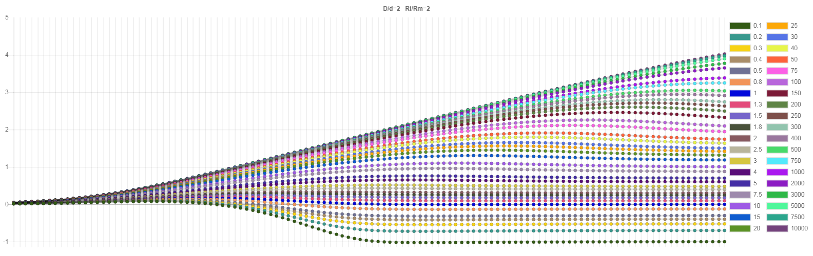

# electron-logarithmic-graph
Visualization of data from a binary file.

It's my first electron project and also project for classes in college. 
The purpose of the application was to visualize a specific data file as a graph and the ability to save as a photo.


## Get started
Install dependencies: 
``` yarn install ``` 

Run app:
``` yarn start```

(you can also use **npm**)

### Live example


### Save plot as image (.png)

